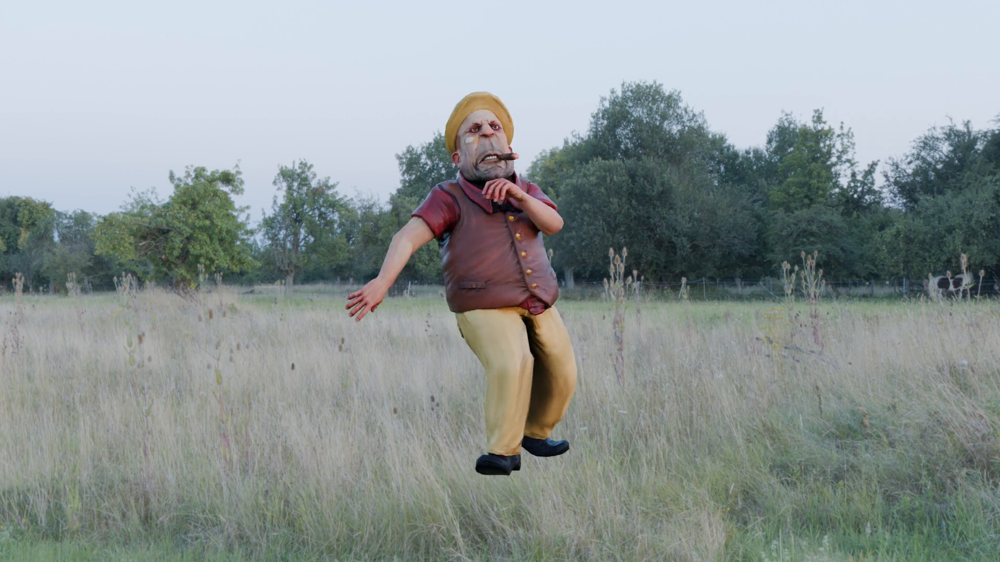
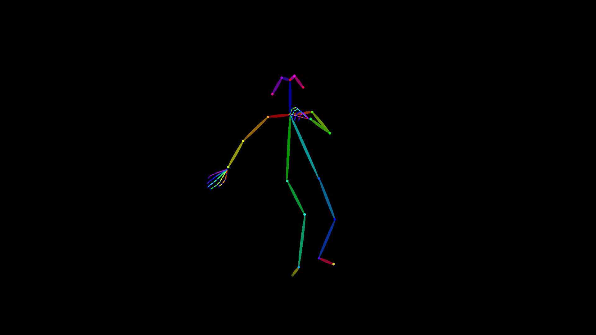

# 🎬 Synthetic Data Generation Pipeline

> Blender-based pipeline for rendering synthetic human motion videos with automatic 2D pose annotations — used to construct the training dataset for our paper.

<!-- TODO: add a banner image showing sample rendered frames -->

*⬆️ placeholder — replace with actual pipeline diagram*

---

## 📌 Overview

Collecting and annotating real-world video data for complex human motions (backflips, cartwheels, martial arts kicks) is expensive, time-consuming, and raises privacy concerns. This pipeline sidesteps all three problems by generating **fully synthetic** training videos with **perfect ground-truth annotations** — no manual labeling required.

The core principle is **domain randomization through combinatorial scene construction**: we systematically pair diverse characters, motion clips, and environment lighting so the resulting dataset spans a broad visual distribution. Models trained on this data learn features that generalize to real footage because the real world becomes "just another variation" within the training distribution.

### 🔧 What this pipeline does

```
┌─────────────┐     ┌──────────────┐     ┌──────────────┐     ┌──────────────────┐
│  FBX Assets │     │  HDR Envmaps │     │   Blender    │     │    Outputs       │
│  (Mixamo)   │ ──► │ (Poly Haven) │ ──► │   Cycles     │ ──► │  video.mp4       │
│  characters │     │  backgrounds │     │   Renderer   │     │  joints.json     │
│  + motions  │     │              │     │              │     │  pose.json       │
└─────────────┘     └──────────────┘     └──────────────┘     │  camera.json     │
                                                               └──────────────────┘
```

For each `(character, background)` pair the pipeline produces:

| Output | Description |
|--------|-------------|
| `video.mp4` | Rendered video (Cycles path tracer, H.264) |
| `joints.json` | Per-frame COCO-17 keypoints in normalized `[0,1]` coordinates |
| `pose.json` | Per-frame raw bone projections in pixel coordinates (all bones) |
| `camera.json` | Virtual camera intrinsics & extrinsics |

---

## 🏗️ Pipeline Stages

### 1️⃣ Asset Preparation

**Characters & Motions** — We source rigged 3D characters with motion-capture animations from [Mixamo](https://www.mixamo.com). Each FBX file bundles a character mesh, skeleton rig, and an animation clip (e.g., backflip, cartwheel, MMA kick). Mixamo provides a wide catalog of both characters (varying body types and clothing) and motions (acrobatics, martial arts, dance), making it straightforward to build combinatorial diversity.

**Environment Maps** — For scene lighting we use HDR environment maps from [Poly Haven](https://polyhaven.com). We primarily use **outdoor scenes** (parks, streets, stadiums) which provide natural, varied illumination. HDR maps wrap 360° around the scene, producing realistic reflections, shadows, and color temperature variation — a lightweight but effective form of lighting domain randomization.

### 2️⃣ Scene Assembly & Domain Randomization

The script pairs every character/motion FBX with every background HDR in a full combinatorial sweep. For `N` characters and `M` backgrounds, this yields `N × M` unique scenes without any manual scene authoring.

Each scene is assembled programmatically:
- Import the FBX character at the world origin
- Configure animation looping via NLA strips (handles clips shorter than the target frame count)
- Place a virtual camera at a fixed front-facing position
- Load the HDR environment map into the world shader

### 3️⃣ Rendering

We use Blender's **Cycles** engine — a physically-based path tracer that simulates realistic light transport (global illumination, soft shadows, color bleeding). Path tracing is slower than rasterization but produces higher visual fidelity, which is important for narrowing the sim-to-real gap in the generated data.

- GPU acceleration via CUDA when available
- 256 samples per pixel (configurable)
- H.264 video output at 1920×1080 / 30 fps

### 4️⃣ Annotation Extraction

After rendering, we extract 2D pose annotations by **projecting 3D armature bone positions onto the camera plane**:

- **Body keypoints** (shoulders → ankles): exact projections of the skeleton's joint positions via Blender's `world_to_camera_view()`. These are geometrically precise.
- **Face keypoints** (nose, eyes, ears): approximated from the head bone's orientation using fixed offsets. These are rough estimates, not true facial landmarks.
- **Bounding boxes**: computed from the convex hull of visible keypoints with a small padding margin.

The script auto-detects the rig convention (Mixamo vs. Unreal Engine Mannequin) and maps bone names to COCO-17 keypoint indices accordingly.

### 5️⃣ Post-Processing with ViTPose

> ⚠️ **Important**: The `joints.json` produced by this script contains **bone-projected ground truth**, NOT pose-estimator predictions. For our paper, we additionally ran [ViTPose](https://github.com/ViTAE-Transformer/ViTPose) on every rendered video to extract detection-based 2D keypoints. This ensures that the final pose annotations match the format and characteristics of a real pose estimator, providing consistency between synthetic and real data in the training pipeline.

---

## 📂 Output Format

### `joints.json` — Projected COCO-17 Keypoints

```json
[
  {
    "frame_id": 0,
    "instances": [
      {
        "boxes": [x, y, w, h],
        "bbox_score": 1.0,
        "keypoints": [[x, y], [x, y], ... ]
      }
    ]
  }
]
```

| Field | Format | Description |
|-------|--------|-------------|
| `frame_id` | `int` | Zero-indexed frame number |
| `boxes` | `[x, y, w, h]` | Bounding box, **normalized** `[0,1]`, top-left origin |
| `bbox_score` | `float` | Always `1.0` (ground truth, not a detection) |
| `keypoints` | `[[x,y]] × 17` | COCO-17 keypoints, **normalized** `[0,1]`, top-left origin |

**Keypoint order** (COCO-17 standard):
```
0: nose          1: left_eye      2: right_eye     3: left_ear      4: right_ear
5: left_shoulder 6: right_shoulder 7: left_elbow   8: right_elbow   9: left_wrist
10: right_wrist  11: left_hip     12: right_hip    13: left_knee    14: right_knee
15: left_ankle   16: right_ankle
```

> 📝 To convert to pixel coordinates: multiply `(x, y)` by `(image_width, image_height)`.

**Key differences from MMPose/ViTPose output:**
- Coordinates are **normalized** (not pixel values)
- Bounding boxes use **xywh** format (not xyxy)
- **No per-keypoint confidence scores** (all keypoints are ground truth)
- Face keypoints are **head-bone approximations**, not predicted facial landmarks

### `pose.json` — Raw Bone Projections

Contains every bone in the armature (not just COCO-17), keyed by original rig bone names, in pixel coordinates:

```json
{
  "frame_0001": {
    "mixamorig:Hips":       [960, 540],
    "mixamorig:LeftUpLeg":  [880, 620],
    ...
  }
}
```

### `camera.json` — Camera Parameters

```json
{
  "location": [0.0, -8.0, 1.0],
  "rotation_euler": [1.5708, 0.0, 0.0],
  "lens": 50.0,
  "sensor_width": 36.0,
  "sensor_height": 24.0,
  "resolution": [1920, 1080],
  "clip_start": 0.1,
  "clip_end": 1000.0
}
```

---

## 🚀 Getting Started

### Prerequisites

- **[Blender 4.x](https://www.blender.org/download/)** (tested with 4.5.0)
- FBX character files from **[Mixamo](https://www.mixamo.com)**
- HDR environment maps from **[Poly Haven](https://polyhaven.com)** (we recommend outdoor scenes)

### Step 1: Download Assets

**Characters & Motions (Mixamo):**
1. Go to [mixamo.com](https://www.mixamo.com) and create a free account
2. Browse characters — select different body types and appearances for diversity
3. Browse animations — search for the motion you want (e.g., "backflip", "cartwheel", "kick")
4. Download as **FBX for Unity (.fbx)** with skin
5. Place all `.fbx` files in a single directory (e.g., `./motions/`)

**Environment Maps (Poly Haven):**
1. Go to [polyhaven.com/hdris](https://polyhaven.com/hdris)
2. Filter by **Outdoor** category for natural lighting variation
3. Download in `.hdr` format (1K or 2K resolution is sufficient)
4. Place all `.hdr` files in a single directory (e.g., `./backgrounds/`)

### Step 2: Run the Pipeline

```bash
# Basic usage
blender --background --python render_motion.py -- \
    --fbx_dir  ./motions \
    --hdr_dir  ./backgrounds \
    --out_dir  ./output

# Custom resolution and frame count
blender --background --python render_motion.py -- \
    --fbx_dir  ./motions \
    --hdr_dir  ./backgrounds \
    --out_dir  ./output \
    --width    1280 \
    --height   720 \
    --frames   60 \
    --fps      24 \
    --samples  128
```

The script renders all `N × M` combinations. Already-rendered combinations are automatically skipped on re-runs, so you can safely interrupt and resume.

### Step 3: Inspect Outputs

Each `(character, background)` pair produces a subfolder:

```
output/
├── BackFlip_outdoor_field/
│   ├── video.mp4
│   ├── joints.json
│   ├── pose.json
│   └── camera.json
├── MmaKick_city_park/
│   ├── ...
```

---

## ⚙️ CLI Arguments

| Argument | Default | Description |
|----------|---------|-------------|
| `--fbx_dir` | *required* | Directory with FBX character files |
| `--hdr_dir` | *required* | Directory with HDR environment maps |
| `--out_dir` | *required* | Output root directory |
| `--width` | `1920` | Render width (px) |
| `--height` | `1080` | Render height (px) |
| `--fps` | `30` | Video frame rate |
| `--frames` | `100` | Number of frames to render (animations loop if shorter) |
| `--samples` | `256` | Cycles samples per pixel (higher = less noise, slower) |

---

## 📊 Sample Outputs

<!-- TODO: replace with actual sample frames from rendered videos -->

| Sample Frame | Skeleton Overlay |
|:---:|:---:|
|  |  |

*⬆️ placeholders — will be replaced with actual rendered samples*

---

## 🧠 Design Decisions

**Why Blender + Cycles?**
Blender's Cycles engine is a production-grade path tracer used in film VFX. Compared to rasterization-based renderers, path tracing produces physically accurate lighting (global illumination, caustics, subsurface scattering) which helps narrow the visual gap between synthetic and real data.

**Why combinatorial pairing?**
Rather than manually designing scenes, we let the Cartesian product of characters × backgrounds × motions generate diversity automatically. This is a scalable form of structured domain randomization — the combinatorial explosion works in our favor.

**Why HDR environment maps?**
A single HDR map simultaneously provides background imagery and scene illumination. By swapping the environment map, we change both the lighting conditions and the visual context in one step. Outdoor HDRIs from Poly Haven offer diverse natural lighting (sunny, overcast, golden hour, etc.).

**Why NLA-based animation looping?**
Many Mixamo clips are only 30–60 frames long. Rather than re-importing or duplicating keyframes, we use Blender's Non-Linear Animation (NLA) system to seamlessly loop clips to any target duration. The CYCLES F-Curve modifier handles extrapolation at the curve level, while the NLA strip repeat count handles it at the clip level.

---

## 📄 Citation

If you use this pipeline or the generated dataset, please cite:

```bibtex
@article{taghipour2025controllable,
  title={Controllable Complex Human Motion Video Generation via Text-to-Skeleton Cascades},
  author={Taghipour, Ashkan and Ghahremani, Morteza and Li, Zinuo and Laga, Hamid and Boussaid, Farid and Bennamoun, Mohammed},
  journal={arXiv preprint arXiv:2603.08028},
  year={2025}
}
```

---

## 📜 License

The rendering code in this repository is released for research purposes. Note that assets downloaded from [Mixamo](https://www.mixamo.com) and [Poly Haven](https://polyhaven.com) are subject to their respective licenses — please review their terms before redistribution.
